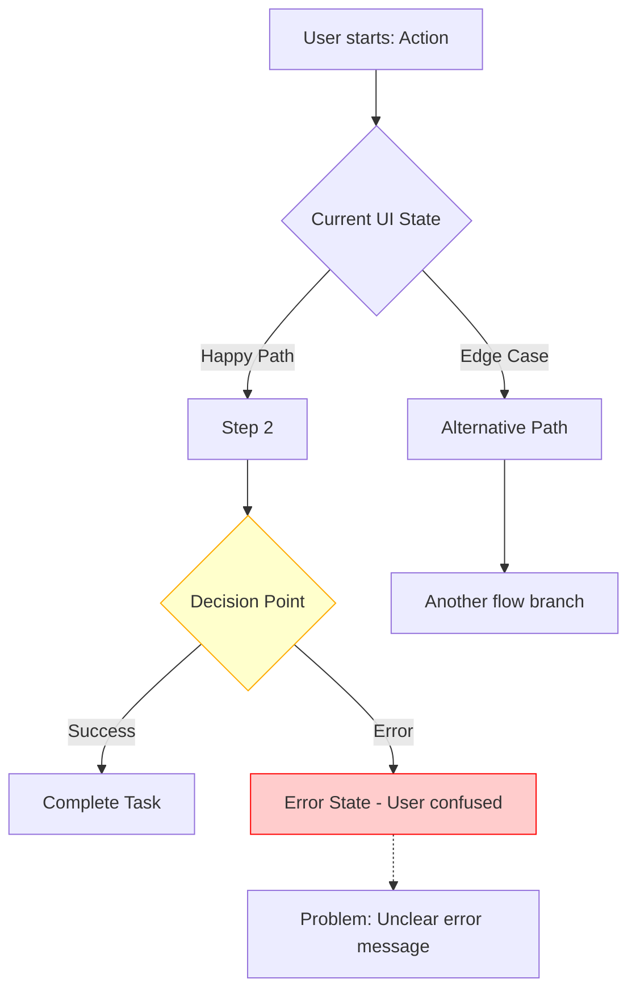
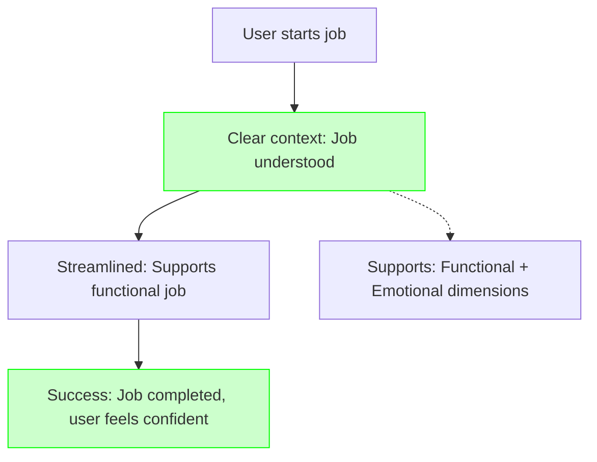

# p2_status_quo_analysis

You are tasked with documenting the current state of a product feature or flow, analyzing how the codebase implements it, creating detailed flowcharts, conducting browser-based UI research, and mapping how the user's job-to-be-done fits (or doesn't fit) into the existing product.

## Initial response

When this command is invoked, respond with:

```
I'm ready to analyze the current state (status quo) of your product. Please provide:

1. **Feature/Flow Name**: What feature or user flow should I analyze?
2. **Product URL(s)**: What page(s)/flows should I examine?
3. **User Context**: Who uses this feature? (role, scenario)
4. **Scope**: Any specific aspects to focus on? (UI, error states, performance, etc.)
5. **Related JTBD Research**: Is there a P### document from `/p1_user_problem_research` I should reference?

Once you provide this information, I'll:
- Analyze the codebase to understand current implementation
- Navigate and interact with the product using browser tools
- Take screenshots of current state at each step
- Document the user flow step-by-step
- Create detailed mermaid flowcharts (current state)
- Map how the JTBD fits (or doesn't fit) into the current product
- Identify gaps between what users need and what exists
```

Then wait for the user's input.

## After receiving the user input

### Phase 1: Information Gathering (Request All Upfront)

Confirm the following before proceeding:
- Feature/flow name
- Product URLs to examine
- User persona/role
- Any existing JTBD research document (P###) to reference
- Scope or specific areas to focus on

### Phase 2: Research Execution

1. **Codebase Analysis** (Use Sub-Agent)
   - Use `sub-agents-mcp` to delegate codebase research:
     - **codebase-locator**: Find where the feature/flow is implemented
     - **codebase-analyzer**: Understand component responsibilities and technical constraints
     - **codebase-pattern-finder**: Find similar patterns or implementations in the codebase
   - Extract code locations for relevant features
   - Identify technical constraints or debt that may contribute to problems
   - Document how the current implementation maps to user needs
   - If `sub-agents-mcp` is not available:
     - Prompt: `sub-agents-mcp is unavailable. Reply CONTINUE to proceed without it (using codebase_search/grep/file reads), or anything else to abort.`
   - If sub-agents fail due to auth, ask the user to run `cursor-agent login` once

2. **Navigate and Document**
   - Navigate to the provided product URL(s) using browser tools
   - Take screenshots at each step of the user flow
   - Document exact click paths and interactions
   - Note loading times, error messages, confusing labels
   - Test edge cases (empty states, error states, large data sets)
   - Save screenshots with descriptive names

3. **User Flow Mapping**
   - Document the complete user journey step-by-step
   - Identify all decision points and branches
   - Map success paths and failure paths
   - Note where users might get confused or stuck
   - Highlight friction points and delays

4. **UI/UX Analysis**
   - Document current interface design
   - Identify specific UI problems:
     - Unclear labels or instructions
     - Hidden or hard-to-find functionality
     - Inconsistent design patterns
     - Poor information hierarchy
     - Missing feedback or confirmation
   - Note accessibility issues
   - Compare with design best practices

5. **Edge Case Testing**
   - Test empty states
   - Test error states
   - Test with large data sets
   - Test with minimal permissions
   - Document all observed behaviors

6. **JTBD Mapping**
   - For each step in the flow, identify:
     - How does this step support (or hinder) the user's job?
     - What job dimensions (functional/emotional/social) does it address?
     - Where does the current flow fail to satisfy the job?
   - Map the gaps between what users need (JTBD) and what exists (current flow)

### Phase 3: Flowchart Creation

1. **Current State Flowchart**
   - Create detailed mermaid flowchart of the current process
   - Include all steps, decision points, and branches
   - Highlight problem areas with red/warning colors
   - Annotate friction points
   - Show error paths and edge cases
   - Use clear, descriptive labels

2. **Desired State Flowchart** (if applicable)
   - Create flowchart showing the ideal future state
   - Show simplified, improved flow
   - Highlight improvements with green/positive colors
   - Show how problems are resolved
   - Keep it realistic and achievable

### Phase 4: Document Structure

Create a status quo analysis artifact with the following structure:

```markdown
---
date: [Current date and time in ISO format]
analyst: Product Analysis Agent
topic: "[Feature/Flow]: Status Quo Analysis"
tags: [status-quo, user-flow, ui-analysis, relevant-feature-names]
status: complete
related_research: [P### document if applicable]
---

# Status Quo Analysis: [Feature/Flow]

## Overview

### Feature Context
- **Feature Name**: [Name of feature or flow]
- **User Persona**: [Who uses this feature]
- **Primary Use Case**: [When and why users use this]
- **Product URLs**: [List of URLs examined]

### Related Research
[If there's a related P### user problem research document, reference it here]
- **JTBD Document**: `thoughts/shared/user_problem/P###_topic.md`
- **Key Job Statement**: "When [situation], I want to [job], so I can [outcome] without [pain point]"
- **Job Dimensions**:
  - Functional: [What user needs to accomplish]
  - Emotional: [How user wants to feel]
  - Social: [How user wants to be perceived]

## Current State Flow

### Flow Overview
[Mermaid flowchart showing the complete current user flow]
- Highlight problem areas with red/warning colors (#ffcccc, #ff0000)
- Annotate friction points with yellow (#ffffcc, #ffaa00)
- Show decision points and edge cases
- Include error paths

Example template:


### Step-by-Step Walkthrough

#### Step 1: [Step Name]
- **Action**: [What the user does]
- **System Response**: [What happens]
- **Screenshot**: `screenshot_001.png`
- **Code Location**: `path/to/component.ext:line-range`
- **JTBD Mapping**: 
  - *Supports Job*: [How this step helps the user's job]
  - *Hinders Job*: [How this step makes the job harder]
  - *Missing*: [What's needed to better support the job]
- **Observations**:
  - [Observation 1: e.g., button is hard to find]
  - [Observation 2: e.g., no loading indicator]
- **Friction Points**: [Any issues at this step]

#### Step 2: [Step Name]
- **Action**: [What the user does]
- **System Response**: [What happens]
- **Screenshot**: `screenshot_002.png`
- **Code Location**: `path/to/component.ext:line-range`
- **JTBD Mapping**:
  - *Supports Job*: [How this step helps the user's job]
  - *Hinders Job*: [How this step makes the job harder]
  - *Missing*: [What's needed to better support the job]
- **Observations**:
  - [Observation 1]
  - [Observation 2]
- **Friction Points**: [Any issues at this step]

[Continue for all steps in the flow]

## Detailed UI/UX Analysis

### Current UI State
- **Screenshot**: `screenshot_overview.png`
- **Layout**: [Description of overall layout]
- **Information Hierarchy**: [How information is organized]
- **Visual Design**: [Color scheme, typography, spacing]

### UI Problems Identified

#### Problem 1: [UI Issue Name]
- **Description**: [What's wrong]
- **Location**: [Where in the UI]
- **Screenshot**: [Reference]
- **Impact**: [How this affects users]
- **Severity**: [Critical/High/Medium/Low]

#### Problem 2: [UI Issue Name]
- **Description**: [What's wrong]
- **Location**: [Where in the UI]
- **Screenshot**: [Reference]
- **Impact**: [How this affects users]
- **Severity**: [Critical/High/Medium/Low]

[Continue for all UI problems]

### Friction Point Analysis

**Major Friction Points:**
1. **[Friction Point 1]**: [Description]
   - *Where*: [Step in the flow]
   - *Impact*: [Time wasted, user confusion, etc.]
   - *Evidence*: [Screenshot or observation]

2. **[Friction Point 2]**: [Description]
   - *Where*: [Step in the flow]
   - *Impact*: [Time wasted, user confusion, etc.]
   - *Evidence*: [Screenshot or observation]

[Continue for all friction points]

## Edge Cases and Error States

### Edge Case 1: [Case Name]
- **Scenario**: [When does this occur]
- **Current Behavior**: [What happens]
- **Screenshot**: [Reference]
- **Issues**: [Problems with current handling]

### Edge Case 2: [Case Name]
- **Scenario**: [When does this occur]
- **Current Behavior**: [What happens]
- **Screenshot**: [Reference]
- **Issues**: [Problems with current handling]

[Continue for all edge cases]

### Error States Observed
- **Error Type**: [Error name or type]
  - **Trigger**: [How to reproduce]
  - **Message Shown**: [Exact error message]
  - **Screenshot**: [Reference]
  - **Problem**: [Why this is confusing or unhelpful]

## Technical Implementation Notes

### Code Locations
- `path/to/component.ext:line-range`: [What this code does]
- `path/to/handler.ext:line-range`: [Relevant implementation detail]

### Technical Constraints
[Any technical limitations discovered during analysis]

### Codebase Research Reference
[Link or reference to any code research artifacts generated by sub-agents]
- Document: `thoughts/shared/code_research/CRNNN_topic.md`

### Technical Constraints
[Any technical limitations discovered during analysis that affect ability to support the job]
- **Constraint 1**: [Description]
  - *Impact on JTBD*: [How this limits job support]
  - *Code Location*: `path/to/file.ext:line-range`
  
- **Constraint 2**: [Description]
  - *Impact on JTBD*: [How this limits job support]
  - *Code Location*: `path/to/file.ext:line-range`

## JTBD Fit Analysis

### How Current Product Supports the Job

**Job Statement**: "When [situation], I want to [job], so I can [outcome] without [pain point]"

**Current Support:**
1. **[Supported Aspect 1]**: [How the current product helps with the job]
   - *Evidence*: [Specific feature or flow]
   - *Effectiveness*: [How well it works]

2. **[Supported Aspect 2]**: [Another way the product helps]
   - *Evidence*: [Specific feature or flow]
   - *Effectiveness*: [How well it works]

### How Current Product Fails the Job

**Job Dimension: Functional** (What user needs to accomplish)
- **Gap 1**: [What's missing or broken]
  - *Impact on Job*: [How this prevents job completion]
  - *Evidence*: [Screenshot, code location, observation]
  - *Current Workaround*: [What users do instead]

- **Gap 2**: [What's missing or broken]
  - *Impact on Job*: [How this prevents job completion]
  - *Evidence*: [Screenshot, code location, observation]
  - *Current Workaround*: [What users do instead]

**Job Dimension: Emotional** (How user wants to feel)
- **Gap 1**: [What creates negative feelings]
  - *Impact on Job*: [How this affects user experience]
  - *Evidence*: [Screenshot, observation]

**Job Dimension: Social** (How user wants to be perceived)
- **Gap 1**: [What affects perception]
  - *Impact on Job*: [How this affects social dimension]
  - *Evidence*: [Screenshot, observation]

### Critical Gaps Between Job and Implementation

1. **[Critical Gap 1]**: [Major mismatch between need and reality]
   - *User Needs*: [From JTBD]
   - *Current Reality*: [From status quo]
   - *Impact*: [Why this matters]
   - *Code Location*: `path/to/file.ext:line-range`

2. **[Critical Gap 2]**: [Another major mismatch]
   - *User Needs*: [From JTBD]
   - *Current Reality*: [From status quo]
   - *Impact*: [Why this matters]
   - *Code Location*: `path/to/file.ext:line-range`

## Desired State Vision

### How to Better Support the Job

Based on JTBD analysis and current state documentation:

1. **[Improvement 1]**: [How to better support the job]
   - *Current Gap*: [What's missing/broken now]
   - *Job Impact*: [Which job dimension this addresses]
   - *Implementation Direction*: [High-level approach]
   - *Success Metric*: [How to measure if job is better supported]

2. **[Improvement 2]**: [How to better support the job]
   - *Current Gap*: [What's missing/broken now]
   - *Job Impact*: [Which job dimension this addresses]
   - *Implementation Direction*: [High-level approach]
   - *Success Metric*: [How to measure if job is better supported]

### Ideal User Flow
[Mermaid flowchart showing the desired future state]
- Show how each step better supports the job
- Highlight improvements with green/positive colors (#ccffcc, #00ff00)
- Show how JTBD gaps are closed
- Remove steps that don't support the job
- Add steps that are missing but needed

Example template:


## Supporting Evidence

### Screenshots
- `screenshot_001.png`: [Step 1 - Initial state]
- `screenshot_002.png`: [Step 2 - Action taken]
- `screenshot_003.png`: [Step 3 - Result]
- [List all screenshots with descriptions]

### Browser Console/Network
- [Any relevant console errors]
- [Any slow network requests]
- [Any failed API calls]

## Summary

### Key Findings
1. **JTBD Fit**: [How well current product supports the job]
2. **Critical Gaps**: [Top 3 gaps between job needs and current implementation]
3. **Technical Constraints**: [Key technical limitations affecting job support]

### How Current Product Maps to JTBD
- **Well Supported**: [Aspects of the job that work well]
- **Poorly Supported**: [Aspects of the job that fail]
- **Not Supported**: [Aspects of the job that are missing]

### Recommended Next Steps
- [ ] Review JTBD fit analysis with product team
- [ ] Prioritize improvements based on job impact
- [ ] Create design mockups that better support the job
- [ ] Plan implementation focusing on critical JTBD gaps
```

### Phase 5: Save and Present

1. **Determine sequence number**
   - Check `thoughts/shared/user_problem/` for existing files
   - If there's a related P### JTBD research document, use same base number with suffix (e.g., P001 JTBD → P001_status_quo)
   - Otherwise use next available number

2. **Create user_problem folder if needed**
   - Create `thoughts/shared/user_problem/` if it doesn't exist

3. **Save artifact**
   - Save to `thoughts/shared/user_problem/PNNN_topic_status_quo.md`
   - Use kebab-case for topic (e.g., `P001_xero-integration_status_quo.md`)

4. **Present summary**
   - Show how current product maps to the JTBD (well/poorly/not supported)
   - Show the current state flowchart
   - Highlight top 3-5 JTBD gaps
   - Show key screenshots
   - Present the desired state flowchart (how to better support the job)
   - Provide path to full artifact

## Research Guidelines

### Codebase Analysis Best Practices
- Use the `c0_research_codebase` sub-agent to keep context clean
- Focus on understanding how implementation maps to user needs
- Identify technical constraints that prevent better job support
- Document relevant code paths for later reference
- Connect code structure to user-facing behavior

### Browser Research Best Practices
- Take screenshots at every step of the user flow
- Document exact click paths and interactions
- Note loading times, error messages, confusing labels
- Test edge cases (empty states, error states, large data sets)
- Save screenshots with descriptive names (e.g., `screenshot_001_initial_state.png`)
- Use browser snapshot to capture page state before taking screenshots

### Flowchart Best Practices
- Use mermaid flowchart syntax (not graph)
- Keep flowcharts focused and readable
- Use consistent styling for problem areas (red/orange) and improvements (green)
- Add annotations for context
- Show all decision points and branches
- Include error paths, not just happy paths

### Documentation Best Practices
- Be specific and detailed
- Every claim needs evidence (screenshot, observation)
- Use clear, descriptive language
- Organize information hierarchically
- Cross-reference related research documents
- Include line numbers or timestamps when relevant

## Notes

- **JTBD Integration**: This command maps the current product reality to the user's job-to-be-done
- **Codebase + Browser**: Use both sub-agents for code analysis AND browser tools for UI research
- **Sub-agent usage**: Use `sub-agents-mcp` (codebase-locator, codebase-analyzer, codebase-pattern-finder) to maintain clean context
- **Mermaid charts**: Use mermaid flowcharts for all process diagrams
- **Evidence-based**: Every claim should reference specific evidence (screenshot, code, observation)
- **Requires p1**: This command works best when there's already a P### JTBD research document to reference
- **Screenshots**: Save all screenshots to the workspace for future reference

