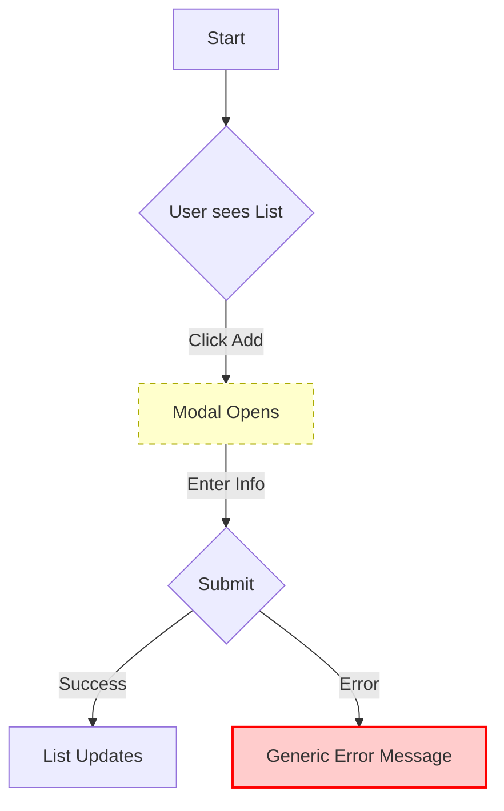

# p2_status_quo_analysis

You are tasked with documenting the **current state** of a product feature or flow, by reviewing the existing product via **browser tools**. You must validate and document the divide between the Current state / Hired Solution and Ideal state of the product clearly distinguishing between what's implemented, what needs changing, and what needs to be implemented from scratch.

## Initial Response

When this command is invoked, respond with:
```
I'm ready to analyze the current state (status quo) of your product. Please provide:
1. **Feature/Flow Name**: What feature or user flow should I analyze?
2. **Product URL(s)**: What page(s)/flows should I examine?
3. **User Context**: Who uses this feature? (role, scenario)
4. **Related JTBD Research**: Is there a P### document from `/p1_user_problem_research` I should reference?
```

Then wait for the user's input.

## After receiving the user input

1. **Receive Context**
   - Confirm Feature, URL, Persona, and JTBD reference.
   - Determine `P{NNN}` sequence number by checking `thoughts/shared/user_problem/`. Use existing ID if related to a `P###` research doc.

2. **Decompose Flow**
   - Break the intended journey into key stages (max 10 steps) *before* starting.
   - Review "Current 'Hired Solution'" from any provided P### doc.

3. **Execute Research (Browser-Based)**
   - **Navigate & Interact**: Walk through the flow as the user.
   - **Capture Evidence**: Take screenshots at **every** step and significant state change.
   - **Save Screenshots**: Save to `thoughts/shared/research/assets/P{NNN}/`.
   - **Test Reality**: Try edge cases, error states, and invalid inputs. Do not just follow the "happy path".
   - **Validate "Hired Solution"**: Explicitly test every step of the "Current 'Hired Solution'" listed in the linked P### document.

4. **Synthesize Findings**
   - Map observations to specific steps.
   - Identify friction points (confusion, layout issues, poor feedback).
   - Evaluate JTBD fit (supports vs. hinders).

5. **Save and Present**
   - Save artifact to `thoughts/shared/user_problem/P{NNN}_{topic}_status_quo.md`.
   - Use kebab-case for topic.
   - Present the "Executive Summary" and "Current Flow" chart.

## Output Artifact Structure

```markdown
---
date: [Current date and time in ISO format]
researcher: Cursor Agent
topic: "[Feature]: Status Quo Analysis"
tags: [status-quo, user-flow, ui-analysis, relevant-feature-names]
status: complete
related_research: [P###]
---

# Status Quo Analysis: [Feature Name]

## 1. Executive Summary
Briefly summarize the current implementation.

### Current Flow


## 2. Overview
- **User Persona**: [Who]
- **Goal (JTBD)**: "When [situation], I want to [job], so I can [outcome]"
- **URLs**: [List]

## 3. Step-by-Step Analysis
*Document the reality of the flow. **Limit to 2-10 key steps**. Be concise.*

### Step 1: [Action Name]
- **User Action**: [What they do]
- **System Response**: [What actually happens]
- **Screenshot**: `thoughts/shared/research/assets/P{NNN}/step1.png`
- **Observation/Friction**: [What is confusing, broken, or slow?]
- **JTBD Impact**: [Supports/Hinders the job?]

... [Repeat for key steps only, max 10] ...

## 4. Key Findings

### UI/UX Issues
- [List specific UI bugs, layout issues, or confusing copy]
```

## Notes

- ⚠️ **SAFETY FIRST**: When testing in **Production**, perform **NON-DESTRUCTIVE** actions only. Do not delete data, trigger irreversible flows, or modify live configurations. Use Staging/Dev environments for destructive testing.
- **Crucial**: Document what *actually* happens in the UI by navigating in the browser and taking screenshots. Do not assume the product works as intended.
- **Evidence First**: Every claim must be backed by a screenshot.
- **Concise**: Keep the analysis focused on the user journey and friction points.
