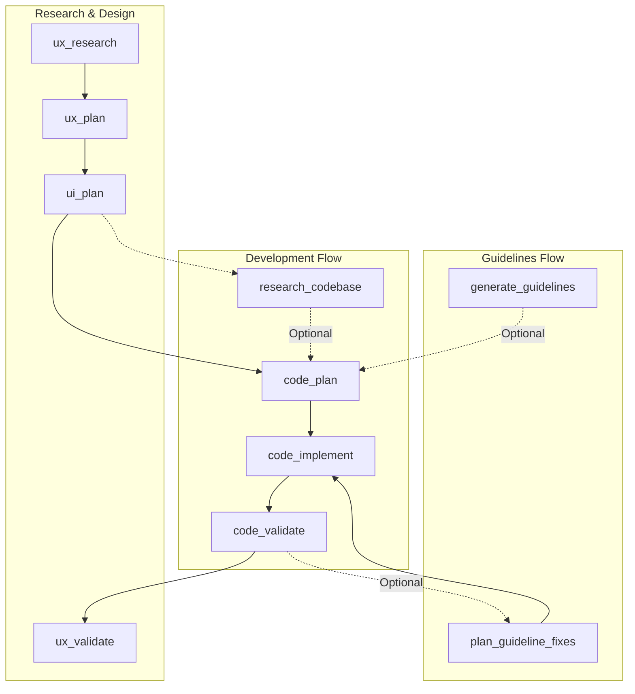

# Cursor Research-Plan-Implement Framework

A structured workflow framework for AI-assisted software development that emphasizes thorough research, detailed planning, and systematic implementation.

## 🚀 Quick Start

```bash
# Run the setup script
./setup.sh /path/to/your/repo

# Or manually copy files
cp -r .cursor /path/to/your/repo/
cp -r thoughts /path/to/your/repo/
cp PLAYBOOK.md /path/to/your/repo/
```

## 📁 What's Included

```
.cursor-framework-adoption/
├── .cursor/
│   ├── commands/                # Numbered workflow slash commands (Cursor)
│       ├── 1_research_codebase.md
│       ├── ...
│       ├── 9_generate_guidelines.md
│       ├── 12_research_ux.md
│       └── (see full list in .cursor/commands/)
│   └── rules/                   # Cursor Rules (always-on and contextual)
│       └── research-plan-implement.mdc
├── thoughts/                    # Context storage structure
│   └── shared/
│       ├── research/
│       ├── plans/
│       ├── sessions/
│       └── cloud/
├── PLAYBOOK.md                  # Comprehensive documentation
├── setup.sh                     # Automated setup script
└── README.md                    # This file
```

## 🗺️ Process Map



### Phase Descriptions

**Research & Design**
- **ux_research**: Gather user insights and requirements (`/12_research_ux`)
- **ux_plan**: Define user journeys and information architecture (`/13_plan_ux`)
- **ui_plan**: Create visual designs and interface specifications
- **ux_validate**: Confirm the solution meets user needs

**Guidelines Flow**
- **generate_guidelines**: Establish engineering standards and patterns (`/9_generate_guidelines`)
- **plan_guideline_fixes**: Strategy to remediate guideline violations (`/11_generate_fix_patterns`)

**Development Flow**
- **research_codebase** (Optional): Analyze existing code to inform technical planning (`/1_research_codebase`)
- **code_plan**: Create a detailed technical implementation plan (`/2_create_plan`)
- **code_implement**: Execute the plan and write the code (`/4_implement_plan`)
- **code_validate**: Verify the implementation against requirements (`/3_validate_plan`)

## 📖 Documentation

- **[PLAYBOOK.md](PLAYBOOK.md)** - Complete guide with examples and best practices
- **Command Files** - Each command file contains detailed instructions for that phase
- **Cursor Rules** - Always-on guidance in `.cursor/rules/` to keep the workflow consistent

## 🎯 Key Benefits

- **📚 Knowledge Accumulation**: Research and plans persist in `thoughts/` directory
- **⚡ Fast Exploration**: Cursor Agent + codebase search help you map systems quickly
- **✅ Quality Assurance**: Built-in validation and success criteria
- **🔍 Deep Understanding**: Thorough research before implementation
- **📋 Clear Specifications**: Detailed plans prevent scope creep

## 🛠 Customization

After installation, customize for your project:

1. **Edit command files** to match your tooling (test commands, linting, etc.)
2. **Update Cursor Rules** in `.cursor/rules/` with project-specific conventions
3. **Adjust directory paths** in commands

## 💡 Typical Workflow Example

```markdown
# 1. Research the existing codebase
/1_research_codebase
> How does the authentication system work?

# 2. Create a plan based on research
/2_create_plan
> Add OAuth2 integration to the authentication system

# 3. Implement the plan
/4_implement_plan
> thoughts/shared/plans/oauth2_integration.md

# 4. Validate implementation matches plan
/3_validate_plan

# 5. Save progress if needed to pause
/5_save_progress

# 6. Resume work later
/6_resume_work
> thoughts/shared/sessions/2025-01-06_oauth2.md
```

## ☁️ Cloud Analysis Example

```markdown
# Analyze your cloud infrastructure (READ-ONLY)
/7_research_cloud
> Azure
> all
```

## 🧪 Test-Driven Development Example

```markdown
# 1. Define test cases for a new feature
/8_define_test_cases
> Partner enrollment workflow with kit orders

# 2. Implement the DSL functions and tests
# (Follow the patterns discovered by the agent)

# 3. Implement the actual feature to make tests pass
/4_implement_plan
> Implement partner enrollment logic
```

## 📝 License

This framework structure is provided as-is for use in your projects. Adapt and modify as needed for your specific requirements.
