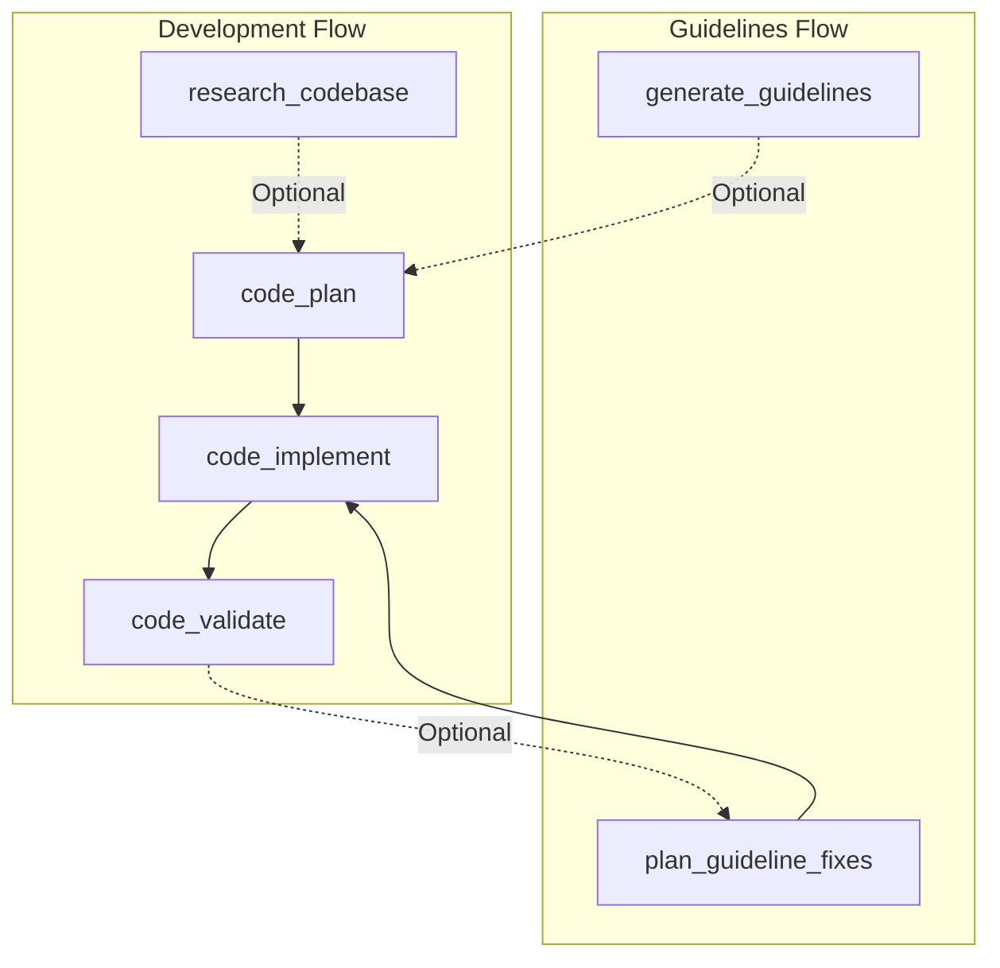

# Cursor Research-Plan-Implement Framework

A structured workflow framework for AI-assisted software development that emphasizes thorough research, detailed planning, and systematic implementation.

## 🚀 Quick Start

Run the setup script to install the framework into your repository:

```bash
./setup.sh /path/to/your/repo
```

The script will guide you through:
1.  **Installation Method**: Copy files (standard) or Symlink (for development/syncing).
2.  **MCP Setup**: Automatically configures required MCP servers (Perplexity, etc.).

Alternatively, you can manually copy the files:
```bash
cp -r .cursor /path/to/your/repo/
cp -r thoughts /path/to/your/repo/
cp PLAYBOOK.md /path/to/your/repo/
# Run MCP setup manually
python3 mcp_setup.py --repo-root /path/to/your/repo/
```

## 📁 What's Included

```
.cursor-framework-adoption/
├── .cursor/
│   ├── commands/                # Workflow slash commands (Cursor)
│   │   ├── c0_research_codebase.md
│   │   ├── c1_code_plan.md
│   │   ├── ...
│   │   └── (see PLAYBOOK.md for full list)
│   └── rules/                   # Cursor Rules (always-on and contextual)
│       └── research-plan-implement.mdc
├── thoughts/                    # Context storage structure
│   └── shared/
│       ├── code_research/
│       ├── code_plans/
│       ├── code_sessions/
│       └── ...
├── PLAYBOOK.md                  # Comprehensive documentation
├── setup.sh                     # Automated setup script
└── README.md                    # This file
```

## 🗺️ Process Map



### Phase Descriptions

**Guidelines Flow**
- **generate_guidelines**: Establish engineering standards and patterns (`/g0_research_guidelines`)
- **plan_guideline_fixes**: Strategy to remediate guideline violations (`/g1_plan_fixes`)

**Development Flow**
- **research_codebase** (Optional): Analyze existing code to inform technical planning (`/c0_research_codebase`)
- **code_plan**: Create a detailed technical implementation plan (`/c1_code_plan`)
- **code_implement**: Execute the plan and write the code (`/c2_code_implement`)
- **code_validate**: Verify the implementation against requirements (`/c3_code_validate`)

## 📖 Documentation

- **[PLAYBOOK.md](PLAYBOOK.md)** - Complete guide with examples and best practices
- **Command Files** - Each command file contains detailed instructions for that phase
- **Cursor Rules** - Always-on guidance in `.cursor/rules/` to keep the workflow consistent

## 🎯 Key Benefits

- **📚 Knowledge Accumulation**: Research and plans persist in `thoughts/` directory
- **⚡ Fast Exploration**: Cursor Agent + codebase search help you map systems quickly
- **✅ Quality Assurance**: Built-in validation and success criteria
- **🔍 Deep Understanding**: Thorough research before implementation
- **📋 Clear Specifications**: Detailed plans prevent scope creep

## 🛠 Customization

After installation, customize for your project:

1. **Edit command files** to match your tooling (test commands, linting, etc.)
2. **Update Cursor Rules** in `.cursor/rules/` with project-specific conventions
3. **Adjust directory paths** in commands

## 💡 Typical Workflow Example

```markdown
# 1. Research the existing codebase
/c0_research_codebase
> How does the authentication system work?

# 2. Create a plan based on research
/c1_code_plan
> Add OAuth2 integration to the authentication system

# 3. Implement the plan
/c2_code_implement
> thoughts/shared/code_plans/CP001_oauth2_integration.md

# 4. Validate implementation matches plan
/c3_code_validate

# 5. Save progress if needed to pause
/cs_save_session

# 6. Resume work later
/cr_resume_session
> thoughts/shared/code_sessions/CS001_oauth2.md
```

## 🧪 Test-Driven Development Example

```markdown
# 1. Define test cases for a new feature
/t1_plan_tests
> Partner enrollment workflow with kit orders

# 2. Implement the DSL functions and tests
# (Follow the patterns discovered by the agent)

# 3. Implement the actual feature to make tests pass
/c2_code_implement
> Implement partner enrollment logic
```

## 📝 License

This framework structure is provided as-is for use in your projects. Adapt and modify as needed for your specific requirements.
