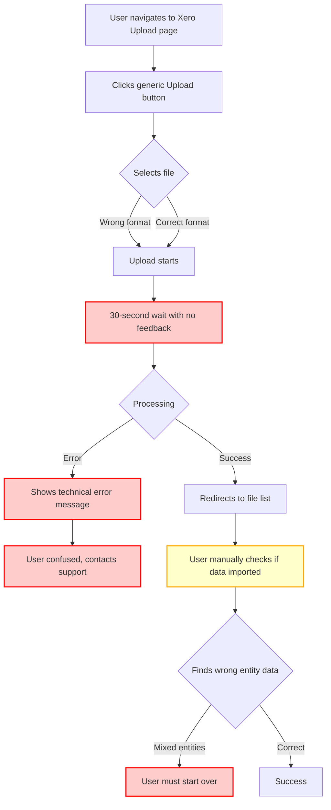
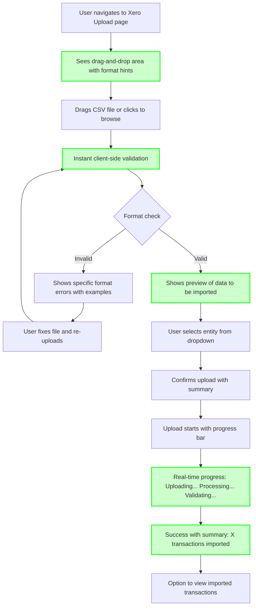

# User Problem Research: File Upload UX

## Problem Definition

### User Context
- **Persona/Role**: Accountant / Finance Manager
- **Scenario**: Uploading bank statements to Xero integration for reconciliation
- **Frequency**: Daily to weekly (during month-end close)

### Jobs-to-be-Done (JTBD) Analysis

**Main Job Statement:**
"When I need to reconcile bank transactions at month-end, I want to upload my bank statements quickly and confidently, so I can complete reconciliation without worrying about file format errors or missing data"

**Job Dimensions:**
- **Functional**: Successfully import bank statement data into the system for reconciliation
- **Emotional**: Feel confident that the upload worked correctly; feel in control of the process
- **Social**: Be seen as efficient and reliable by my manager; deliver reconciliations on time

**Current "Hired Solution":**
Users manually upload CSV files through a generic file upload interface, then check if the data imported correctly by reviewing transaction lists

**Desired "Ideal Solution":**
An intelligent upload interface that validates files in real-time, provides clear feedback on what's happening, guides users through format issues, and confirms successful import with a summary

### Problem Evidence

List of specific pain points with evidence:

- **No file format guidance at upload time**: 
  - *Evidence*: Screenshot shows generic "Choose File" button with no indication of accepted formats
  - *Code Location*: `src/components/FileUpload/XeroUpload.tsx:45-67`
  - *Impact*: Users waste time uploading wrong formats, only to discover the error after processing

- **File library doesn't distinguish between entities**: 
  - *Evidence*: Users report seeing files from different legal entities mixed together
  - *Code Location*: `src/services/fileService.ts:123-145` - no entity filtering in query
  - *Impact*: Users accidentally use wrong entity's data, causing reconciliation errors

- **No progress indication during upload**:
  - *Evidence*: Screenshot shows no feedback during 30-second upload process
  - *Code Location*: `src/components/FileUpload/XeroUpload.tsx:78-82` - missing progress callback
  - *Impact*: Users don't know if upload is working, may refresh page or click multiple times

- **Error messages are technical, not user-friendly**:
  - *Evidence*: Screenshot shows "Error: INVALID_CSV_SCHEMA" instead of explaining what's wrong
  - *Code Location*: `src/services/xeroIntegration.ts:234-238` - returns raw error codes
  - *Impact*: Users don't understand what to fix, must contact support

## Status Quo Document

### Current State Flow

### Detailed Status Quo Analysis

#### Current Implementation
- **UI/UX**: 
  - Screenshot: `screenshot_001_current_upload.png`
  - Simple file input with "Choose File" and "Upload" buttons
  - No format hints, no drag-and-drop, no preview
  - Issues: 
    - No indication of accepted file types
    - No validation before upload starts
    - No progress indication
    - Generic error messages

- **Backend/Logic**: 
  - Code Location: `src/services/xeroIntegration.ts:180-250`
  - Technical Constraints: 
    - File processing is synchronous, blocking the request
    - No chunked upload support for large files
    - Entity filtering happens after upload, not during selection
    - Error handling returns raw exceptions

- **User Experience**: Step-by-step walkthrough
  1. User navigates to Xero integration page
  2. Clicks "Upload Statement" button
  3. Sees generic file picker dialog
  4. Selects CSV file (may or may not be correct format)
  5. Clicks "Upload" button
  6. Waits 30+ seconds with no feedback
  7. Either:
     - Success: Redirected to file list (must manually verify data)
     - Error: Sees "INVALID_CSV_SCHEMA" or similar technical message
  8. If error, user must guess what's wrong or contact support

#### Problem Highlights

**JTBD Perspective:**
- **Job to be Done**: Upload bank statements confidently for reconciliation
- **Current Friction**: 
  - No confidence during upload (no feedback)
  - Discovery of errors happens too late (after upload completes)
  - Entity mixing creates downstream reconciliation errors
  - Technical error messages don't guide users to solutions
- **Gap**: Users need real-time validation, clear guidance, and confidence that their upload will work

**Specific Product Pages/Features:**
- **Page/Feature**: Xero Upload Interface
  - **URL**: `https://app.example.com/xero/upload`
  - **Problem**: No file format guidance, no progress feedback, poor error messages
  - **Screenshot**: `screenshot_001_current_upload.png`
  - **Code**: `src/components/FileUpload/XeroUpload.tsx:45-82`

- **Page/Feature**: File Library View
  - **URL**: `https://app.example.com/files`
  - **Problem**: Files from different entities are mixed together
  - **Screenshot**: `screenshot_002_file_library.png`
  - **Code**: `src/services/fileService.ts:123-145`

### Critical Thinking: Current vs. Desired State

**What's Missing:**
- **Upfront validation**: No client-side format checking before upload
- **Progress indication**: No feedback during upload/processing
- **Entity awareness**: No entity selector or entity-based file organization
- **User-friendly errors**: No actionable error messages with solutions
- **Preview/confirmation**: No way to preview data before finalizing import

**What's Broken:**
- **Error discovery timing**: Errors only shown after full upload/processing cycle
- **File organization**: Entity mixing causes downstream confusion and errors
- **Upload performance**: Synchronous processing blocks UI for 30+ seconds
- **Error handling**: Technical error codes don't help users fix problems

**What's Confusing:**
- **Format requirements**: Users don't know what CSV structure is expected
- **Entity selection**: No clear indication which entity the file will be imported to
- **Success confirmation**: After upload, users aren't sure if data is correct
- **Error resolution**: When errors occur, users don't know how to fix them

### Desired State Vision

**Ideal User Flow:**

**Expected Outcomes:**
- **Faster uploads**: Users catch format errors before uploading, saving time
- **Higher confidence**: Preview and entity selection give users control and confidence
- **Fewer errors**: Upfront validation prevents downstream reconciliation errors
- **Less support load**: Clear error messages with examples reduce support tickets
- **Better UX perception**: Modern drag-and-drop interface with feedback feels professional

**Success Metrics:**
- Reduce upload error rate from 15% to <5%
- Reduce support tickets related to file uploads by 60%
- Improve user satisfaction score for upload experience from 2.5/5 to 4.5/5
- Reduce average time-to-successful-upload from 3 minutes to 1 minute

## Supporting Evidence

### Screenshots
- `screenshot_001_current_upload.png`: Current generic file upload interface with no guidance
- `screenshot_002_file_library.png`: File library showing mixed entities without clear organization
- `screenshot_003_error_message.png`: Technical error message "INVALID_CSV_SCHEMA" with no explanation

### Code References
- `src/components/FileUpload/XeroUpload.tsx:45-82`: Current upload component implementation
  - Generic file input, no validation, no progress indication
  - Missing: format hints, entity selector, preview functionality

- `src/services/xeroIntegration.ts:180-250`: Backend upload processing
  - Synchronous processing blocks requests
  - Returns raw error codes instead of user-friendly messages
  - No entity filtering at query level

- `src/services/fileService.ts:123-145`: File library query
  - Missing entity filter in database query
  - Causes mixed entity files in UI

### Codebase Research Reference
- Document: `thoughts/shared/code_research/CR045_xero_integration_flow.md`
  - Details the full Xero integration architecture
  - Identifies file upload as a bottleneck in the reconciliation workflow
  - Notes that error handling is inconsistent across the integration

## Recommendations

### Priority 1: Critical Jobs Unmet
1. **Add entity selector to upload interface** - Prevents entity mixing, addresses core job requirement
2. **Implement real-time format validation** - Catches errors before upload, saves user time
3. **Add progress indication** - Provides confidence that system is working

### Priority 2: High-Friction Areas
1. **Improve error messages** - Make errors actionable with examples of correct format
2. **Add data preview before final import** - Gives users confidence and control
3. **Implement drag-and-drop** - Modernizes interface, reduces friction

### Priority 3: Quick Wins
1. **Add accepted format text to UI** - Simple copy change, immediate clarity improvement
2. **Add entity filter to file library** - Backend query change, fixes organization
3. **Optimize upload processing** - Make async to prevent blocking

## Open Questions
- What are the exact CSV format requirements? (Need to document for user guidance)
- Are there different format variations by bank/region that we should handle?
- Should we support other formats beyond CSV (Excel, OFX)?
- What's the file size limit? Should we support chunked uploads for large files?
- Should file library have folders/categories beyond entity filtering?

